  

<!-- rest of your README -->

# 💫 About Me:
🔭 I’m currently working on 👯 I’m looking to collaborate on 🤝 I’m looking for help with 🌱 I’m currently learning 💬 Ask me about ⚡ Fun fact

## 🌐 Socials:
    

# 💻 Tech Stack:

### 🛠️ Languages:
     

### 🎨 Frontend:
      

### ⚙️ Backend & Database:
     

### 🧠 AI & Data Science:
       

### ☁️ Tools & Cloud:
            

# 📊 GitHub Stats:
 
 

## 🏆 GitHub Trophies

### 🔝 Top Contributed Repo

---

  ## 💰 You can help me by Donating
   
